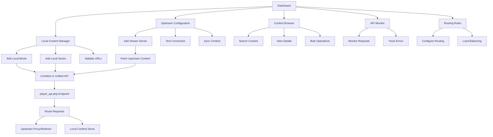

## 1. Product Overview

NeroPanel is a **Xtream Codes Proxy/Middleware Panel** that acts as a bridge between upstream Xtream Codes servers and end-user streaming applications. The panel fetches content from upstream Xtream APIs, allows administrators to inject local content, and serves a unified API endpoint that combines both upstream and local content streams.

This middleware solution enables IPTV service providers to aggregate multiple Xtream sources, add custom local content, and provide a single unified API endpoint for their streaming infrastructure. The panel handles content routing - redirecting upstream content requests while serving local content directly.

## 2. Core Features

### 2.1 User Roles

| Role | Registration Method | Core Permissions |
|------|---------------------|------------------|
| Admin | Manual setup via environment variables | Full access: configure upstream Xtream credentials, add local content, manage routing rules, view system logs |
| System | Automated service account | Background operations: fetch upstream content, sync data, handle API requests |

### 2.2 Feature Module

Our Xtream Codes Proxy Panel consists of the following main pages:

1. **Dashboard**: System overview, upstream connection status, content statistics, and routing performance.
2. **Upstream Configuration**: Manage upstream Xtream server credentials, connection settings, and sync policies.
3. **Local Content Manager**: Add, edit, and manage local movies/series with external streaming URLs.
4. **Content Browser**: Unified view of all content (upstream + local) with search and filtering capabilities.
5. **API Monitor**: Real-time monitoring of player_api.php requests, response times, and error tracking.
6. **Routing Rules**: Configure how different content types are routed (proxy vs redirect vs direct serve).

### 2.3 Page Details

| Page Name | Module Name | Feature description |
|-----------|-------------|---------------------|
| Dashboard | Upstream Status | Display connection status to configured Xtream servers, response times, and authentication health. |
| Dashboard | Content Statistics | Show total content count (upstream vs local), sync status, and content type breakdown. |
| Dashboard | API Performance | Monitor player_api.php request volume, response times, and error rates with real-time graphs. |
| Upstream Configuration | Server Management | Add/edit upstream Xtream servers with URL, username, password, and connection timeout settings. |
| Upstream Configuration | Sync Settings | Configure automatic content fetching intervals, retry policies, and content filtering rules. |
| Upstream Configuration | Test Connection | Validate Xtream credentials and test API connectivity with detailed response logging. |
| Local Content Manager | Add Local Movie | Form to add movies with title, description, poster URL, and external streaming URL. |
| Local Content Manager | Add Local Series | Form to add series with season/episode structure and external streaming URLs per episode. |
| Local Content Manager | Content Validation | Validate streaming URLs, check content accessibility, and verify metadata completeness. |
| Content Browser | Unified Search | Search across both upstream and local content with filters for source, genre, and content type. |
| Content Browser | Content Details | View detailed information including source (upstream/local), streaming URL, and routing method. |
| Content Browser | Bulk Operations | Select multiple items for batch operations like sync, delete, or routing rule changes. |
| API Monitor | Request Logs | Real-time log of player_api.php requests with parameters, response codes, and timing. |
| API Monitor | Error Tracking | Track and categorize API errors, failed requests, and upstream connection issues. |
| Routing Rules | Content Routing | Configure routing behavior: proxy upstream content, redirect to original URLs, or serve local content directly. |
| Routing Rules | Load Balancing | Distribute requests across multiple upstream servers based on performance or geographic rules. |

## 3. Core Process

The main admin flow begins at the Dashboard where administrators monitor upstream server connections and overall system health. Administrators first configure upstream Xtream servers through the Upstream Configuration page, inputting server URLs and credentials. The system automatically fetches and caches content from these upstream sources. Local content is added through the Local Content Manager, where admins can inject custom movies and series with external streaming URLs. The Content Browser provides a unified view of all available content from both sources. The panel exposes a player_api.php endpoint that streaming applications call - this endpoint returns combined content lists and handles stream routing based on configured rules. Upstream content requests are either proxied or redirected to original URLs, while local content is served directly from the configured external URLs.

## 4. User Interface Design

### 4.1 Design Style

- **Primary Color**: Deep blue (#1E40AF) for headers and primary actions
- **Secondary Color**: Slate gray (#475569) for secondary elements
- **Accent Color**: Green (#10B981) for success states and active connections
- **Button Style**: Rounded corners (6px radius) with subtle shadows and hover effects
- **Font**: Inter for body text, Roboto for headings
- **Layout Style**: Card-based layout with consistent spacing and responsive grid systems
- **Icons**: Lucide React icons for consistency and modern appearance
- **Background**: Light gray (#F9FAFB) with white cards for content sections

### 4.2 Page Design Overview

| Page Name | Module Name | UI Elements |
|-----------|-------------|-------------|
| Dashboard | Status Cards | Grid of metric cards with blue gradient backgrounds, white text, and connection status indicators. |
| Dashboard | Activity Chart | Line graph showing API request volume over time with green for successful requests, red for errors. |
| Upstream Configuration | Server Cards | Horizontal cards showing server status with colored indicators (green=connected, red=failed, yellow=syncing). |
| Local Content Manager | Content Forms | Two-column layout with input fields having blue focus borders, URL validation indicators, and preview thumbnails. |
| Content Browser | Search Interface | Sticky search bar with advanced filter dropdowns, source toggle buttons (All/Upstream/Local). |
| API Monitor | Log Viewer | Monospace font table with syntax-highlighted JSON responses, expandable rows for detailed request info. |
| Routing Rules | Rule Cards | Interactive cards showing routing logic with drag-and-drop priority ordering and condition builders. |

### 4.3 Responsiveness

The application follows a desktop-first design approach optimized for administrative use. Primary functionality targets screens 1280px and wider for optimal dashboard viewing. Mobile responsiveness includes collapsible navigation, touch-friendly interface elements (minimum 48px touch targets), and simplified data views for smaller screens. Tablet views maintain multi-column layouts where feasible while ensuring all administrative functions remain accessible.

### 4.4 3D Scene Guidance

Not applicable for this middleware proxy panel application.